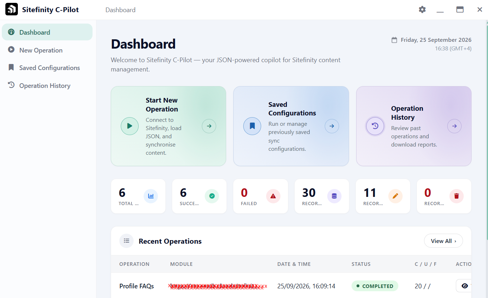
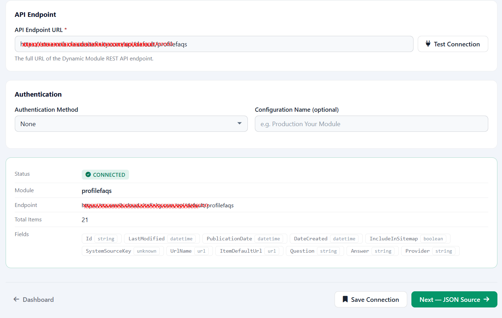
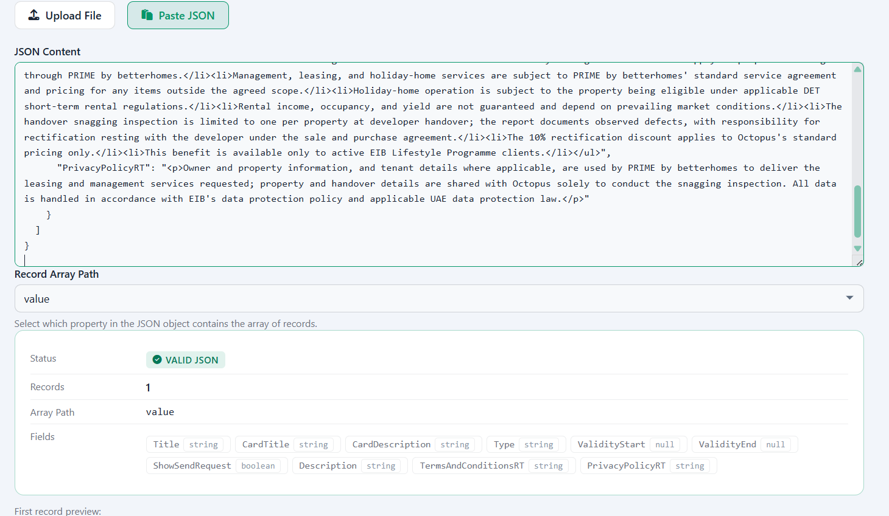
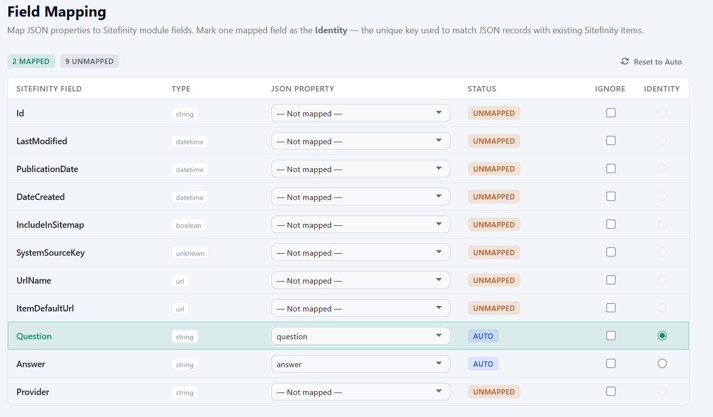
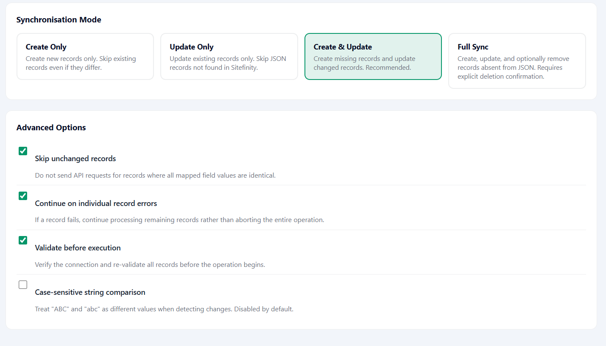
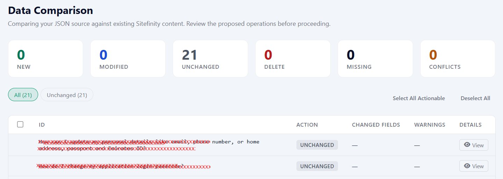

# Sitefinity C-Pilot

**Your JSON-powered copilot for Sitefinity content management.**

Sitefinity C-Pilot is a desktop tool for creating, injecting, modifying, and updating content in Sitefinity CMS Dynamic Modules from structured JSON files.

This first version is the application shell: a splash screen and a single main menu. Sitefinity connections and JSON operations are not included yet.

## Gallery








## Getting started

```bash
npm install
npm start
```

On first launch the app creates a data folder under Documents named `Sitefinity CPilot`. The database, logs, and settings are stored there.

## Scripts

| Script | Purpose |
| ------ | ------- |
| `npm start` | Launch the Electron app |
| `npm test` | Run unit tests |
| `npm run lint` | Run ESLint |
| `npm run sync:vendor` | Copy Font Awesome into `src/renderer/vendor` |
| `npm run generate:icon` | Rebuild the Windows icon |
| `npm run build:win` | Build an NSIS installer |

## License

MIT — see [LICENSE](LICENSE).
